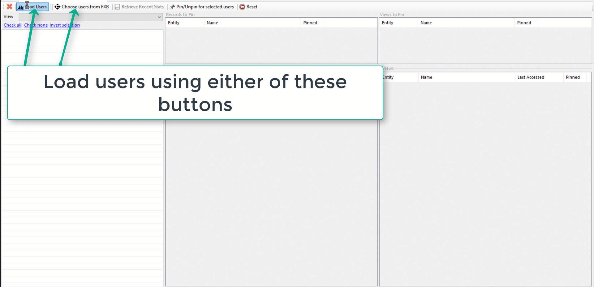

# Recent Items Manager
XrmToolBox plugin to view and manager user's recent items and pin them if required.

# Known issue
If the user whose recent records are being modified, has an active session, the changes made by this tool will not show up in Dynamics CRM/Dynamics 365. Make the changes to users who are not currently using Dynamics CRM/365.

# Installation
Install the tool from XrmToolBox store

# Usage

# Credits
* [Push pin icon by Freepik](https://www.flaticon.com/free-icon/push-pin_265701)
* [User Settings Utility](https://github.com/MscrmTools/MsCrmTools.UserSettingsUtility) by Tanguy
